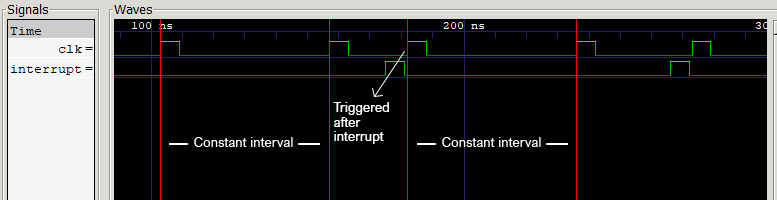
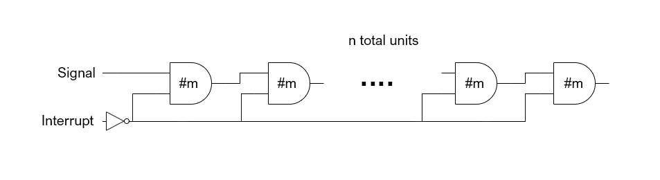

# Async RISCV
Verilog model of an asynchronous RISCV CPU by Mukhesh Pugalendhi (EE18B114).

## Design description

The design consists of different modules as detailed below.

### Control module

This module controls handling of the signals that maintain the workflow. The characteristics of the module are as follows:
 - It produces a clock signal that is of a particular frequency
 - It accepts an input which is like an interrupt
 - When the interrupt triggers, it resets the clock signal and the clock starts from that particular instant with the same frequency as before

 Signal waveforms

This set of characteristics can be utilized in a peculiar way.

The modified cpu module has an output signal that denotes the end of the current instruction. This output signal is routed to the interrupt of the control module. Then the output clock of the control block acts as the cpu clock. This way the next instruction can be loaded and executed just after the previous instruction.

The time period of the default clock signal is set longer than the time the slowest instruction takes. This default clock signal acts as a backup if for some reason the done signal fails to fire. This can happen if two similar instructions are chained so that the output to register doesn't change (and the end is not detected).

### Delay module

A separate module introduces the delay responsible for the clock. This is a set of slow and-gates chained in a fashion shown below.

 Introducing delays with and-gate chain. Total delay = n*m

The above circuit propagates the signal with a delay. Along with that the interrupt signal can be used to turn off the propagating signal in between if necessary.

### The CPU
The CPU itself is mostly the same from the previous synchronous version. The only difference is that it generates a done signal at the end of the instruction. This is done by looking for changes in rvout for ALU instructions, jaddress for jump and branch instructions etc. In addition to this, there is a mechanism using delay matching to make sure that the done signals correspond to the instruction present at that particular cycle.

## Delay modelling
The entire CPU is designed deliberately to make use of pure combinational logic as much as possible. This made delay modelling easier. The submodules (ALU, imem, dmem, regfile) are assigned delays appropriately. The delays are not very accurate numerically but are reasonably good in highlighting relative delays in subcomponents.

## Synthesis
Since my partner dropped out before we began anything, I couldn't afford time for synthesis. I instead did some research on real life components that mimic the various functionality required by our design. Even if the design cannot be synthesized by typical methods, there are ways in which the design can be realized.

## Existing hardware
The following are components that are closely similar to and therefore can be easily modified into what is required.

### Delay matching
The chaining of the and-gates in the control block to generate backup signal is very much similar to matching delays with inverter chains. In fact, [[1]](https://www.analog.com/media/en/training-seminars/design-handbooks/high-speed-design-seminar/Section7.pdf) shows us methods of programming delays into the circuit in the order of several nano seconds which is perfect for our use case.

### Self-resetting latches
A strange component is being used in the design of the control block and the CPU that behaves like a flip-flop but different in the fact that it auto resets after a short period of time. This can be done using self-resetting latches as described in [[2]](http://www.cs.cmu.edu/~seth/papers/dac07-sr.pdf).

### Detecting change in signal
In the verilog model, an always block is used for this purpose. It triggers a flip-flop when the sensed signal changes. Since always-blocks are not meant for this purpose, changes in signals can be detected by use of registers. Let us consider a 32 bit wide signal to be monitored. We need to raise a pulse whenever the signal value changes. We can do this by feeding the signal to a register as the input. A comparator is used to check if the input is same as the value stored in the register. The output of the comparator (LOW if same; HIGH if different) is fed to the register as clock but with a delay as required for the specific pulse width. This output is pulled to detect changes in the signal.

## Benchmarking
The same set of tests used for the single cycle synchronous CPU assignment was used to verify the working of this CPU. The following table lists time taken by both CPUs for executing the tests with the same delay settings. The time is measured using gtkwave. Initial 100 ns for reset is not included.

|test|instruction count|asynchronous CPU (ns)|synchronous CPU (ns)|% performance increase|
|--|--|--|--|--|
|1|96|5664|3781|49.8|
|2|59|3068|1856|65.3|
|3|59|3068|1940|58.1|

 Time taken by synchronous CPU is computed by multiplying the number of instructions to the time taken by the slowest instruction.

## References
1. [Time Delay Generators](https://www.analog.com/media/en/training-seminars/design-handbooks/high-speed-design-seminar/Section7.pdf)
2. [Self-Resetting Latches for Asynchronous Micro-Pipelines
](http://www.cs.cmu.edu/~seth/papers/dac07-sr.pdf)

